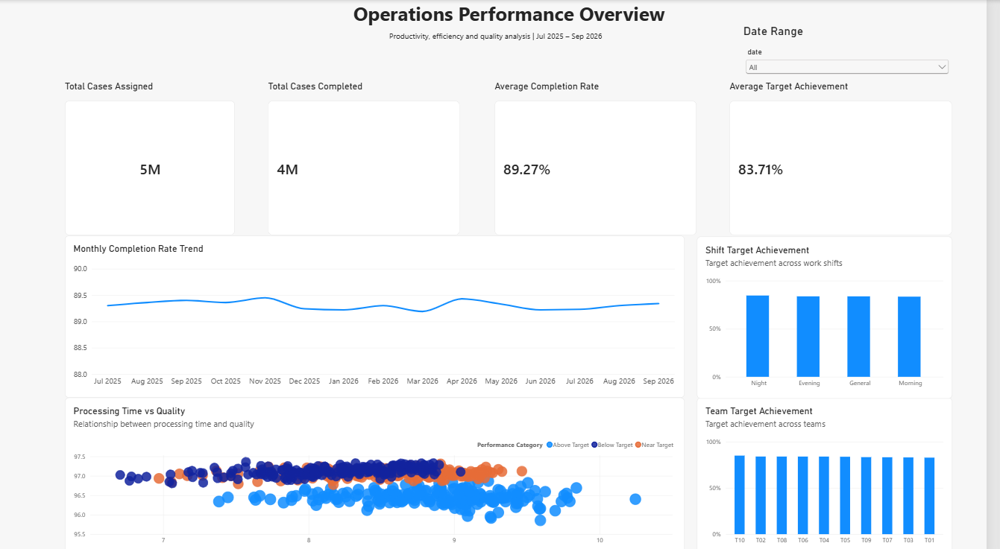
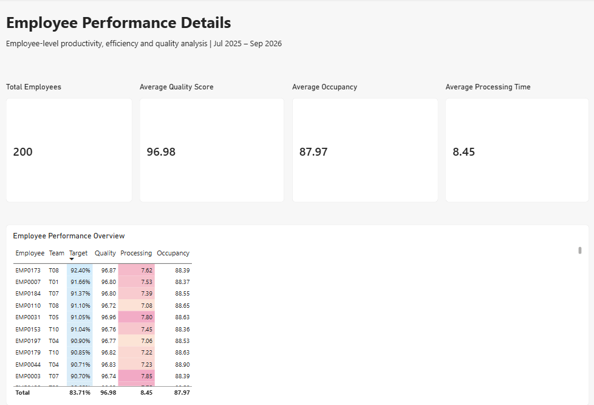

# Operations Performance Analytics Dashboard

## Project Overview

An end-to-end operations performance analytics project built to analyze productivity, efficiency, quality, and workforce performance across 75,000 operational records.

The project transforms raw operational data into SQL-driven performance analysis and an interactive Power BI dashboard covering overall KPIs, monthly trends, team performance, shift performance, and employee-level analysis.

The dashboard was built as an end-to-end Data Analytics project using Excel, PostgreSQL, SQL, and Power BI.

## Business Objective

The objective of this project is to understand:

- Overall operational productivity
- Completion and target achievement trends
- Team and shift performance
- Employee-level performance
- Processing efficiency
- Quality and error patterns
- The relationship between processing time and quality

## Tools & Technologies

- Excel
- PostgreSQL
- SQL
- Power BI
- CSV

## Dataset

The dataset contains approximately 75,000 operational records covering:

- 200 employees
- 10 teams
- 4 shifts
- July 2025 to September 2026

Key metrics include:

- Cases Assigned
- Cases Completed
- Completion Rate
- Target Achievement
- Average Processing Time
- Quality Score
- Error Rate
- Occupancy
- SLA Status

## Dashboard Pages

### 1. Operations Overview

Provides a high-level view of operational performance, including:

- Total cases assigned
- Total cases completed
- Average completion rate
- Average target achievement
- Monthly completion-rate trend
- Team target achievement
- Shift target achievement
- Processing time vs quality analysis

### 2. Employee Performance

Provides employee-level analysis including:

- Total employees
- Average quality score
- Average occupancy
- Average processing time
- Employee target achievement
- Employee quality performance
- Employee processing efficiency
- Employee occupancy

## Key Analytical Findings

- Overall completion rate was approximately 89.27%.
- Overall target achievement was approximately 83.71%.
- Average processing time was approximately 8.45 minutes.
- Average quality score was approximately 96.98%.
- Average occupancy was approximately 87.97%.
- Night shift recorded the highest average target achievement among the four shifts.
- Team-level target achievement showed relatively narrow variation across the 10 teams.
- Employee-level analysis showed substantial variation in target achievement and processing time.

## Project Workflow

Excel / CSV  
↓  
Data Cleaning & Preparation  
↓  
PostgreSQL  
↓  
SQL Analysis & Views  
↓  
Power BI  
↓  
Interactive Dashboard

## Project Deliverables

- Cleaned operational dataset
- PostgreSQL database and SQL analysis
- Power BI dashboard
- Dashboard PDF export
- Project documentation
- ## Dashboard Preview

### Operations Overview

### Employee Performance

